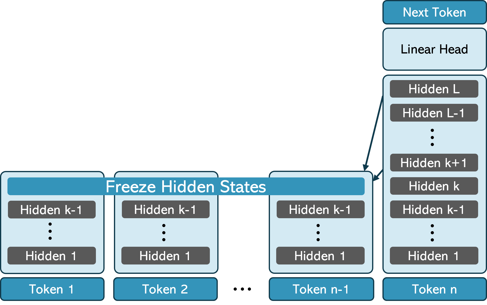
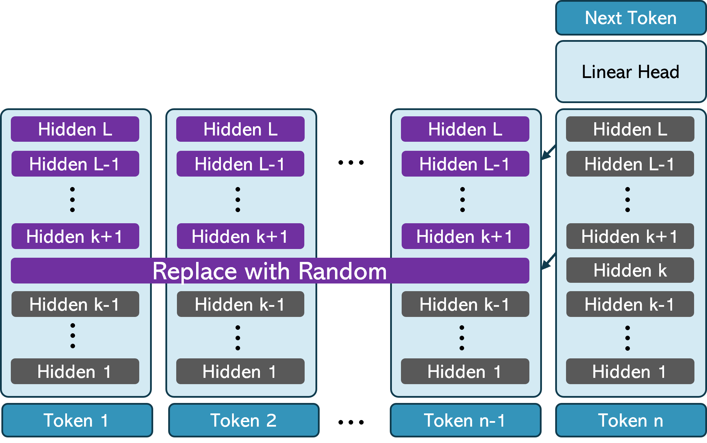
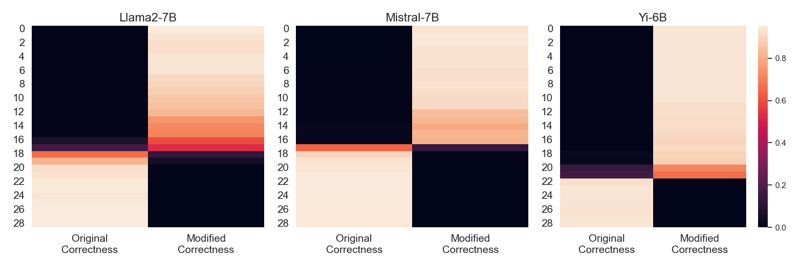

# Attend First, Consolidate Later: On the Importance of Attention in Different LLM Layers

This repository contains the code for the [paper](https://arxiv.org/abs/2409.03621) Attend First, Consolidate Later: On the Importance of Attention in Different LLM Layers by Amit Ben Artzy and Roy Schwartz.

<p float="center">
  
  
</p>

# How to use
First set the environment:

```bash
pip install transformers==4.43.1
```

Llama2-7B, Yi-6B and Mistral-7B are supported.

## Freeze, Random, Shuffle

Sample code for using the Freeze, Random and Shuffle:

```
from transformers import AutoTokenizer, AutoModelForCausalLM
from convert_models.convert_models import enable_skip_attention
import torch

tokenizer = AutoTokenizer.from_pretrained("your_model")
model = AutoModelForCausalLM.from_pretrained("your_model")

input_ids = tokenizer("Your Prompt",
						return_tensors="pt").input_ids.to('cuda:0')

manipulation_layer = 15
manipulation_options = ["freeze", "random", "shuffle"]
manipulation_type = manipulation_options[0]

enable_manipulated_gen(model)
output = model(input_ids,
                       distrupt_type=manipulation_type,
                       distrupt_layer=manipulation_layer
                       )

```

## Skip Attention

Here is a sample code to use the manipulation of Skip Attention:
```
from transformers import AutoTokenizer, AutoModelForCausalLM
from convert_models.convert_models import enable_skip_attention
import torch

tokenizer = AutoTokenizer.from_pretrained("your_model")
model = AutoModelForCausalLM.from_pretrained("your_model")

input_ids = tokenizer("Your Prompt",
						return_tensors="pt").input_ids.to('cuda:0')

skip_attention_from = 15

enable_skip_attention(model)
output = model(input_ids,
				skip_attention_layers=range(skip_attention_from, 100),
				)
```

## Information Injection

<p float="center">
  
</p>


A demo for using the information injection is in `information_injection_demo.py`.


## Citation


```bib
@article{BenArtzy2024Sep,
	author = {Ben Artzy, Amit and Schwartz, Roy},
	title = {{Attend First, Consolidate Later: On the Importance of Attention in Different LLM Layers}},
	journal = {arXiv},
	year = {2024},
	month = sep,
	eprint = {2409.03621},
	doi = {10.48550/arXiv.2409.03621}
}
```
