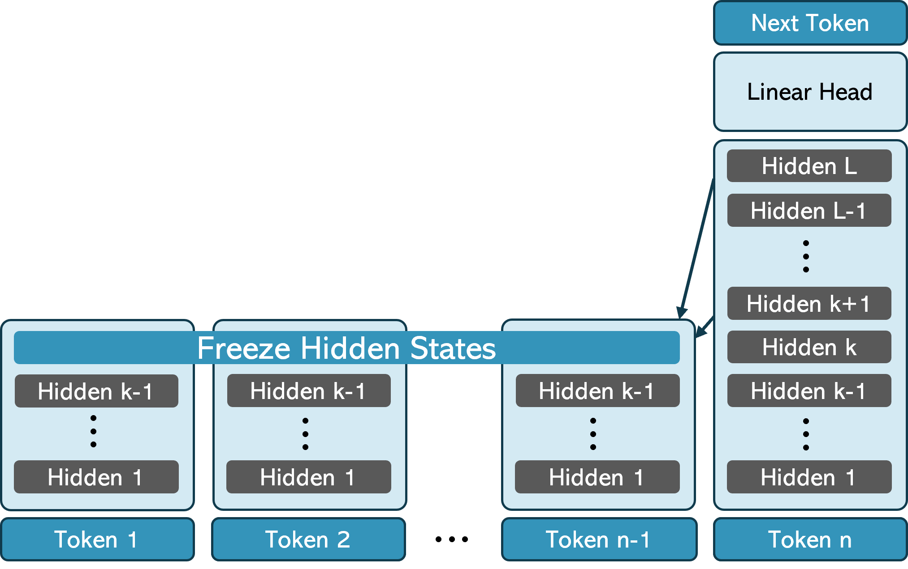
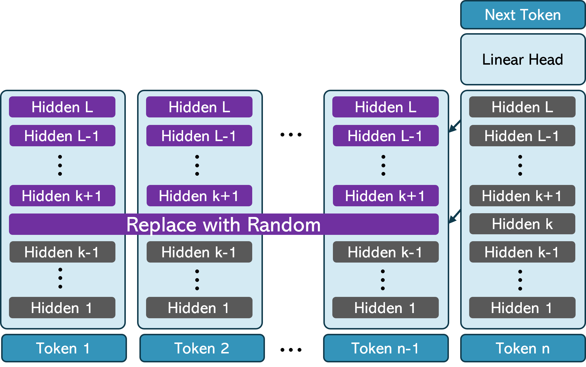

# Attend First, Consolidate Later: On the Importance of Attention in Different LLM Layers

This repository contains the code for the [paper](https://arxiv.org/abs/2409.03621) Attend First, Consolidate Later: On the Importance of Attention in Different LLM Layers by Amit Ben Artzy and Roy Schwartz.

<p float="left">
  
  
  </p>

## How to use
First set the environment:

```bash
pip install transformers==4.43.1
```

A demo for usage is in `demo.py`.

## Citation


```bash
@article{Artzy2024Sep,
	author = {Artzy, Amit Ben and Schwartz, Roy},
	title = {{Attend First, Consolidate Later: On the Importance of Attention in Different LLM Layers}},
	journal = {arXiv},
	year = {2024},
	month = sep,
	eprint = {2409.03621},
	doi = {10.48550/arXiv.2409.03621}
}
```
